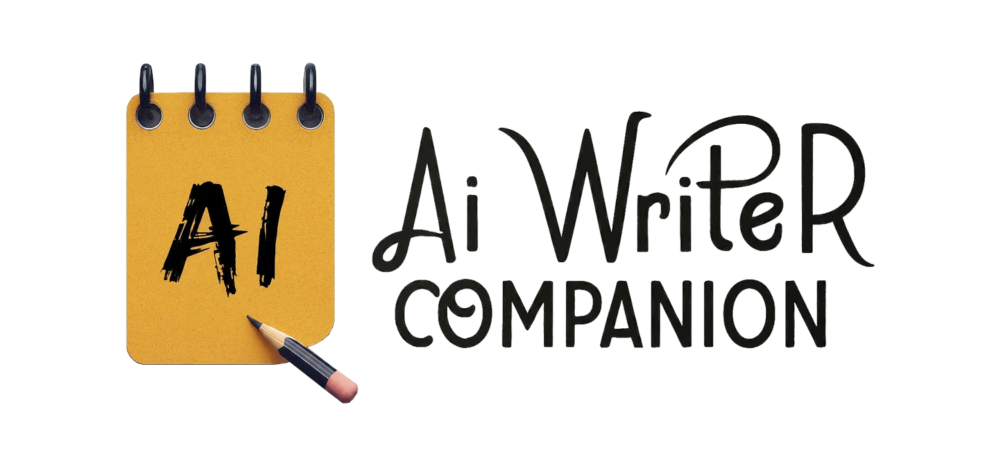

# AI Writer Companion

> [!WARNING]
> Este projeto foi descontinuado e não receberá novas atualizações. A ferramenta continuará a funcionar até que o API do Google AI Studio mude o suficiente para tornar o código atual obsoleto. Obrigado pelo interesse e por ter utilizado o AI Writer Companion.

### ⓘ O que é?
Esta é uma ferramenta em Python desenvolvida para ajudar escritores nas suas criações. Com ela, é possível rapidamente consultar por antônimos, sinônimos, e significados de palavras (mais funções ainda em desenvolvimento). Desta forma, você gasta menos tempo procurando ou pesquisando por palavras para substituir alguma possível repetição no texto e pode usar este tempo para escrever e se expressar ainda mais em suas criações!

_**Vale lembrar que o conteúdo gerado por AI pode não estar correto 100% das vezes, então lembre-se de tomar cuidado ao utilizar esta ferramenta.**_

### ⓘ Como utilizar?
Existem duas formas de utilizar esta ferramenta, ambas listadas abaixo:

####  Metódo 1 (Fácil e Recomendado) - Arquivo executável
Caso você não pretenda alterar o código fonte e apenas utilizar a ferramenta, este método é para você!

1. Faça o download da última versão da ferramenta através da aba [Releases](https://github.com/Luisovc1812/AI-Writer-Companion/releases), ela será um arquivo _**.zip**_
2. Extraia o conteúdo zipado para sua pasta de preferência.
3. Execute o arquivo _**AI Writer Companion.exe**_ e aproveite!

#### Metódo 2 - Usando o código fonte
Caso você pretenda analisar ou modificar o código, use este método.

1. Instale o Python através [deste link](https://www.python.org/downloads/). (Caso você já o tenha, pule esta etapa)
2. Baixe este repositório através da opção de clonar do GitHub, ou simplesmente [clicando neste link](https://github.com/Luisovc1812/AI-Writer-Companion/archive/refs/heads/main.zip).
3. Extraia o conteúdo do arquivo .ZIP em algum diretório da sua preferência.
4. Nos arquivos extraidos, siga as etapas abaixo.
    * Quando você estiver iniciando o projeto pela **primeira vez**, você deve exectuar o arquivo _**"Instalar Requisitos Iniciais.bat"**_ para que as bibliotecas Python necessárias sejam instaladas do seu computador. Caso você prefira fazer isto manualmente, as bibliotecas são: "pillow", "customtkinter" e "google-generativeai".
    * Após fazer esta intalação, basta executar o arquivo _**"Iniciar o AI Writer Companion.bat"**_ sempre que quiser utilizar a ferramenta! **Não é necessário repetir o primeiro passo novamente**.
5. Após iniciar a ferramenta, você será guiado através dos passos iniciais e depois disto já poderá utilizá-la!

### ⓘ Como foi feito?
Esta ferramenta foi criada em sua maior parte durante apenas 2 dias, com mais de 24 horas apenas contando durante seu trabalho. Esta foi a primeira vez que criei uma ferramenta usando Python, e eu já preferi diretamente tentar fazer algo mais complexo como a interface gráfica da qual esta ferramenta apresenta, possibilitando de uma interação mais amigável com o usuário.

Ainda existem ferramentas das quais não estão disponíveis, como a opção para que a AI ajude você diretamente a continuar o seu texto, ou até mesmo dar sugestões de como você pode continuar narrativas, mais isto tudo será implementado em futuras atualizações.

Além de servir para mim como um estudo em Python, e uma ferramenta para ajudar a comunidade de escritores ao redor do mundo, esta ferramenta também foi desenvolvida com o intuito para ser uma entrada para a competição de projetos da Alura no curso de #ImersãoAI Alura+Google.

### ⓘ Licensas de uso
 
<a property="dct:title" rel="cc:attributionURL" href="https://github.com/Luisovc1812/AI-Writer-Companion">AI Writer Companion</a> is licensed under <a href="https://creativecommons.org/licenses/by-sa/4.0/?ref=chooser-v1" target="_blank" rel="license noopener noreferrer" style="display:inline-block;">CC BY-SA 4.0</a>
 

As marcas e empresas do Google e Alura não tem afiliação direta com esta ferramenta, mas foram utilizados da tecnologia do Google AI Studio e Gemini 1.5 Pro que são propriedades da Google, assim como a empresa Alura foi mencionado por este projeto também ser uma entrada para um de seus eventos.